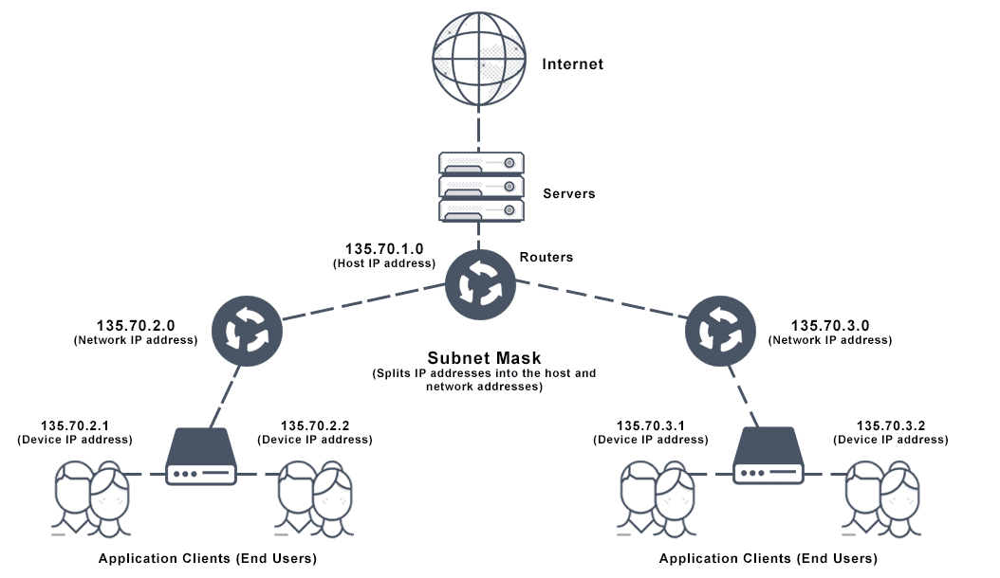

# Internet
#tech

**What is the internet**

Internet - huge network of computing devices communicating with each other based on a pre-agreed set of rules called protocols.

**How does this network is formed and works?**

The edge devices that are part of this network are called _hosts_ or _end systems_. Laptops, mobiles etc are hosts. 

These end systems are connected by a network of _communication links_ and _packet switches_. 

`communication links. - physical medium such as copper wires, fiber optics etc.`

One end system sends data to another by segmenting the data into small segments with header bytes on them. These packages of information are called _packets_ and are sent through the network to the destination end system where they are reassembled into original data.

A packet switch is responsible for routing the packets to its destination. 

The packet switch takes a packet arriving on one of its incoming communication links and forwards that packet on one of its outgoing communication links.

Packet switching is the transfer of small pieces of data across various networks. These data chunks or “packets” allow for faster, more efficient data transfer.

_Packets sending_
Often, when a user sends a file across a network, it gets transferred in smaller data packets, not in one piece. For example, a 3MB file will be divided into packets, each with a packet header that includes the origin IP address, the destination IP address, the number of packets in the entire data file, and the sequence number.

Our _routers_ are a packet switch. The sequence of communication links and packet switches transversed by a packet in known as the _route_ through the network.

> A factory that needs to move a large amount of cargo to some destination warehouse located thousands of kilometres away. At the factory, the cargo is segmented and loaded in a fleet of trucks. Each of the trucks then independently travels through the network of highways, roads, and intersections to the destination warehouse. At the destination warehouse, the cargo is unloaded and grouped with the rest of the cargo arriving from the same shipment.  
_Computer Networking by _**_Kurose and Ross_**

— In many ways, packets are analogous to trucks, communication links analogous to highways and roads. Packet switches are analogous to intersections, and end systems are analogous to buildings.

**What are ISPs, TCP/IP and RFCs?**

End systems access the internet through **Internet Service Provider — ISPs**. 

Each ISPs is in itself a network of packet switches and communication links. 

All the components of this network run protocols that control the sending and receiving information. A protocol defines the format and the order of the messages exchanged between two or more communicating entities, as well as the actions taken on the transmission and/or receipt of a message or other events. 

The **Transmission Control Protocol (TCP)** and **Internet Protocol (IP)** are the most important protocols. **TCP/IP**

> TCP/IP provides unanimous functioning and thus important that everyone agrees on what each and every protocol does. These Internet standards are developed by the Internet Engineering Task Force (IETF). The IETF standard documents are called **request for comments - RFCs**  

**What are client and server program and P2P architecture?**

A client program is a program running on one end system that request and receives a service from a server program running on another end system. The web browser is an example of a client program and Nginx or NodeJs or Tomcat is an example of a server program.

_Peer-to-peer (P2P)_ applications, in which end systems interact and run programs that perform both client and server functions. 

Eg, File-sharing P2P applications (_BitTorrent_) the program in the user’s end system act as client when it request a file from another peer; and the programs acts as a server when it sends a field to another peer.

**LAN and WAN**

**Local Area Network (LAN)** is a computer network, which is limited to a small office, a single building, multiple buildings inside a campus etc. Typically a LAN is a private network owned and maintained by a single organisation.

**A Wide Area Network (WAN)** spans over multiple geographic locations, which is composed of multiple LANs. ISPs provide the connectivity solutions for WAN.

**IP address**

For one device to communicate with another, it needs an **IP address**, and it must be **unique**. If there is another device on the same network with the same IP there will be an IP address conflict and both devices will lose network capability until this is resolved.

The IP address consists of **4 numbers separated by decimals**. The IP address itself is separated into a **network address** and a **host address**. This means that one part of the IP address identifies the computer network ID and the other part identifies the host ID.

As an example, an IP address of 192.168.0.11 with subnet mask(discussed later) 255.255.255.0 uses the first 3 numbers to identify the network and the last number to identify the host. So, the network id would be 192.168.0 and the host id would be 11.

 Devices can only communicate with other devices on the same network id. In other words, communication will work between 2 devices with IPs 192.168.0.221 and 192.168.0.11 respectively but neither can communicate with 192.168.1.31 because it is part of the 192.168.1 network.

**Subnet Mask** - As a general rule, wherever there is a 255 in the subnet mask then the corresponding number of the IP address is part of the network id; where there is 0 in the subnet mask the corresponding number in the IP address is part of the host id. 

For an IP address of 192.168.0.1 with a subnet mask of 255.0.0.0, this tells the device that the first number of the IP address is used as the network address, and the last 3 are used as the host id. In this example the computer network would be 192.x.x.x. As long as another computer has the same subnet mask and an IP address starting with 192, they can communicate with each other.

If the subnet mask was 255.255.0.0 then this means that the first 2 numbers identify the network instead (192.168.x.x). Therefore to be on the same network both devices must have IP addresses starting with 192.168.

**How do devices on different networks communicate**

Communication across different network IDs take place with the help of a router. A router is a network device with 2 network interfaces (NICs) each being on separate network ids. 

Eg. We may have 2 networks; 192.168.1.x and 192.168.2.x. On one NIC the router would have the IP address 192.168.1.1 and on the other, it would have the IP address of 192.168.2.1. Devices on the on both network can now communicate with each other via the network.

**How does the data travel from origin end system to destination end system**

The default gateway is where a network device sends traffic to if it doesn’t know where is the destination IP address.

If a network device tries to communicate another device on a separate network, it forwards the data to whatever IP address is specified in the default gateway.

This is because it does not know of this other network and that it needs to send the data to a gateway out of its network. 

This is why we always put the IP address of the router in the default gateway field.

Because a router will be attached to multiple networks, so it knows where these other networks are and it can _route_ traffic to them. 

Routers also have default gateways so that if they don’t know where the destination is then they can also send the data to its own default gateway. This continues up the IP network hierarchy until it eventually finds a router that is part of the destination network. This last router knows where the destination is and sends it on its way.

**DHCP - Dynamic Host Configuration Protocol**

Network devices need to be configured with an IP address, subnet mask and default gateway that will be unique to that network. Generally, we don’t manually configure them but are configured automatically using DHCP servers.

Servers and some routers can be configured to act as a DHCP server. It allots the IP addresses to the connecting devices so to prevent IP address conflicts.

**How does a router function**

A router should have at least two network cards (NICs), one physically connected to one network and the other physically connected to another network. A router can connect any number of networks together providing it has a dedicated NIC for each network.

All network devices that use the TCP/IP protocol have a routing table.
All devices use their routing table to determine where to send packets. When a device sends packets to another device, it looks at its routing table to determine the best route possible. If it finds the destination address is “on-link” it knows that it is a part of the same subnet as the destination and sends the packets directly to the device. If not it forwards the packet onto whatever is in the gateway field of the matching route entry. This same process is repeated at every router/hop along the way until it eventually arrives at a router that is part of the destination network.

**What is a port?**

In internet / networking, a _port_ is an endpoint of communication in an operating system. 
In software it is a logical construct that identifies a specific process or a type of network service.

A port is always associated with an IP address of a host and the protocol type of the communication, and thus completes the destination or origination network address of a communication session. 

 A port is identified for each address and protocol by a 16-bit number, commonly known as the **port number**. For example, an address may be “protocol: TCP, IP address: 1.2.3.4, port number: 80”, which may be written 1.2.3.4:80 when the protocol is known from context.

What the above text basically mean is that any communication between network devices take place over a port, which is a software construct that helps in data reception and processing for the network devices. The port, which is the number after “:” in the IP address defines the port on which the data has to be sent. We must have seen port numbers in the URLs. By default, HTTP uses port 80 and HTTPS uses port 443, and we don’t add them in the browser but are implicitly handled by the browsers. But a URL like http://www.example.com:8080/path/ specifies that the web browser connects instead to port 8080 of the HTTP server.

**Domain Name and IP Address**

Q. How does IP address like 123.123.123.123 relates to web address of http://www.example.com?

example.com is called a Domain name. Domain names are the human-friendly forms of Internet addresses and are commonly used to find websites. The **domain name system (DNS)** is essentially a global addressing system. 

A domain name such as example.com is a unique alias for an IP address http://123.123.123.123:80, which is an actual physical point on the Internet.

The **Internet Corporation for Assigned Names and Numbers (ICANN)** is a non-profit organization responsible for coordinating the maintenance and procedures of several databases related to the namespaces of the Internet. 

We can buy a domain name from a vendor and others for a period and then tell that domain to point to an actual server address using websites of those vendors.

**Public IP address**

A public IP address is an IP address that our home or business router receives from your ISP. Public IP addresses are required for any publicly accessible network devices, like for our home router as well as for the servers that host websites.

Public IP address are what differentiate all devices that are plugged into the public internet. Each and every device that’s accessing the internet is using a unique IP address. It’s this address that each ISP uses to forward internet requests to a specific home or business. 

**Port Forwarding**

Port forwarding or port mapping is an application of network address translation (NAT) that redirects a communication request from one address and port combination to another while the packets are traversing a network gateway, such as a router or firewall. 

